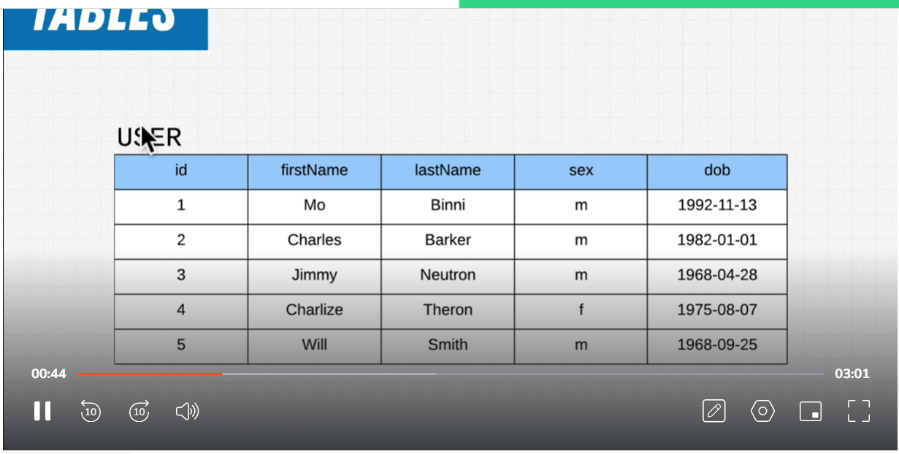
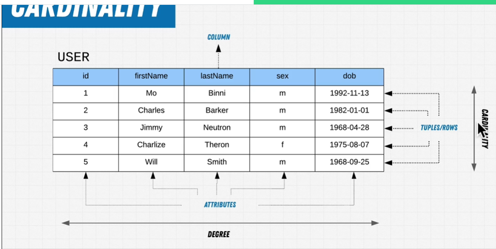
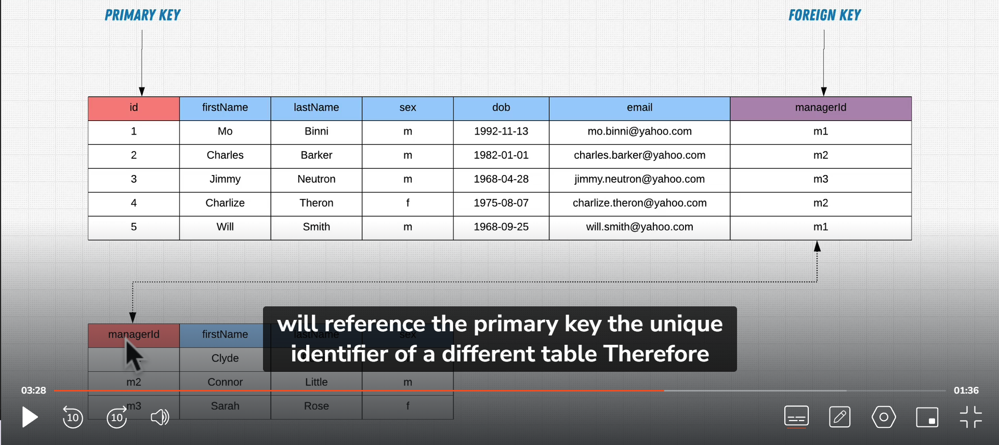

# SQL

SQL is a devlarative language(langauage that we are stating what will happen)

testing query: https://www.db-fiddle.com/f/ogAiTgZPjwvDxwVHiVK3Ek/0

# Schema
defines the structure of the database. It includes the definitions of tables, columns, data types, indexes, views, and other database objects.

# QUERY BREAKDOWN
quick note SQL statement and query are the same

`identifier` is just a different word for a part of the data(column or table)

# Relational Model

## Tables

    tables is representation of that object. It is collection of columns and rows

## Column

    Each column represent specific type of data.

    Degree : collection of columns.

    Attribute domain/Constraint: is what column can store.

## Row

    Each of single row is a piece of data that represent one single piece data of that table

    Some people call tuple(It is basiclly row)

    Each and every tuple/row follow the column constraints

    Cardinality: collections of rows/tuples

## Primary key

    Primary key is something that uniquely identifies data.

## Foriegn key

    Foriegn key references the primary key of a different table.

# How we use database

1) `OLTP(online transaction processing)`

    For a day to day transactional for driving business. E.X. Amazon what this user's order, order's history, his card number.

    E.X.
    
    - A database is being used to log orders and customers.

2) `OLAP(online analytical processing)`

    For future decision. A separate database that connects to the data warehouse being making analytical on it so we can think how to improve our product, website in future.

    E.X.

    - A database is being used to figure out what new products we should offer.

    - A database is being used to drive statistics for reporting to the executives.

# QUERY syntax

Renaming a columns
SELECT column as '<new name>'

