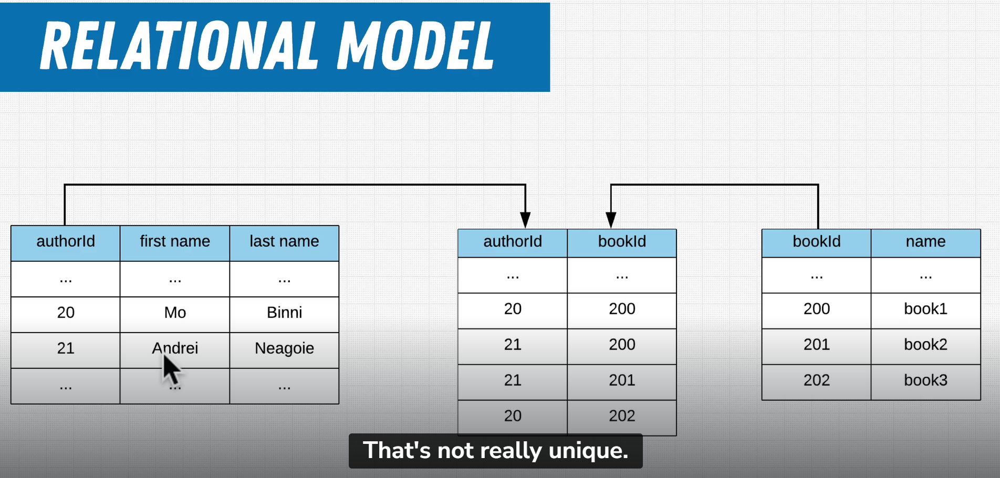

# History of database and terms

**What's database**. It is collection of data(software ), allows a user's command for accessing and manipulating that data.

Database is basiclly some computer with database software on top.

**Schema** : defines the structure of the database. It includes the definitions of tables, columns, data types, indexes, views, and other database objects.

**query** is a way to communicate with databases. Queries are used to retrieve and manipulate data stored in a database.

**DataBase Management System(DBMS)** is a software or its program that is used to manage the database. It receives instructions from somebody like us that want something to do with data and instructs the database the way we want

**Relational DataBase Management System** is same thing as DBMS but more specific by suing relational database model

**Structured Query Language(sql)** : It's a way for us to interact with DBMS

# 5 main types of databases

1) `Relational model database`: mysql, postgresql. It follows table structure. Data is storing in tables, rows and cloumns 

2) `Document model database`: MongoDB, Firebase. Data is in document

3) `Key Value database`: Redis

4) `Graph database`: AWS Neptune.
store in grpah model. It good for data that connected in different ways. It's all about relationship between different units. E.X. social networks might use this type of database bc how different users are connected to one another. They are leasted used bc they are so specific

5) `Wide Columnar`
